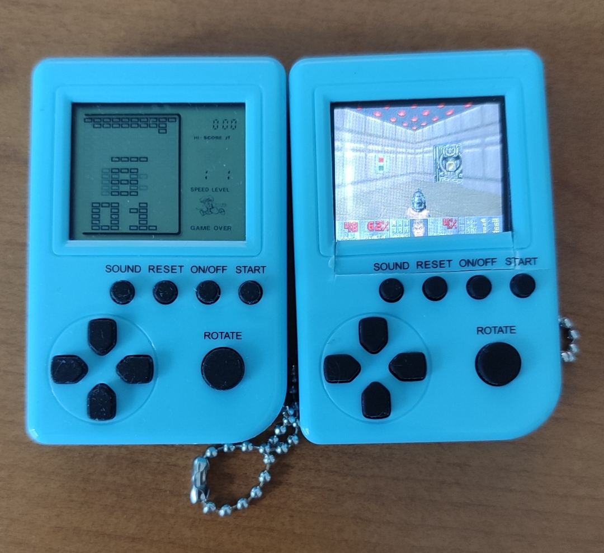
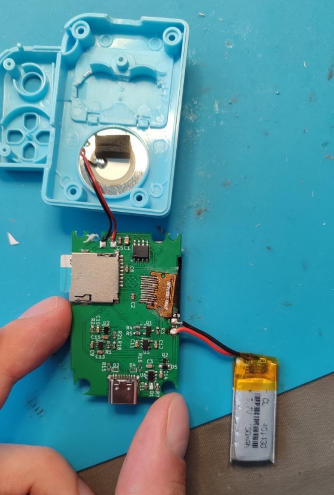
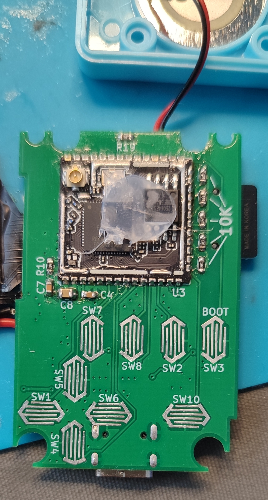
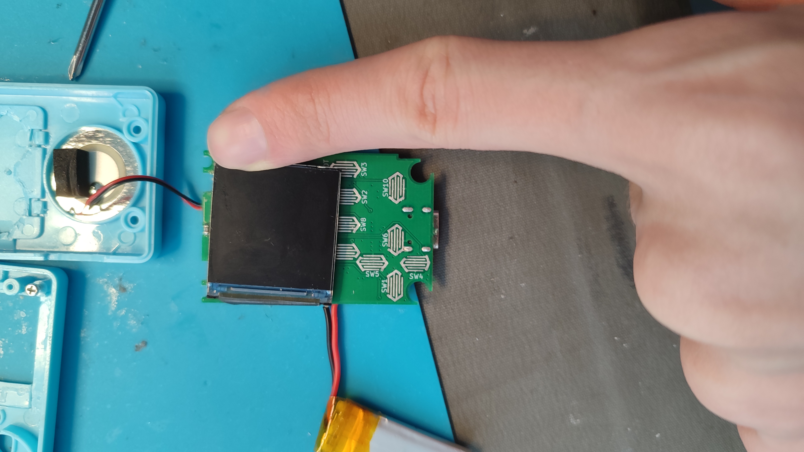

# ESP32 hema console
 New PCB for the small console from hema to use an ESP32

## <https://github.com/ducalex/retro-go>
The esp32 uses Retro-go to emulate games

## Side by side comparison with the original one

## Some pictures of the PCB

Known problems :
- The buttons doesn't make great contact compared to the original PCB

Components :
- ESP32 module without PCB antenna
- 1.54 inches IPS 240*240px
- about 3*30*30mm battery or 4*15*30mm

Note : it is almost the same schematic as my Retro-Ruler
## <https://github.com/rapha-tech/Retro-Ruler>